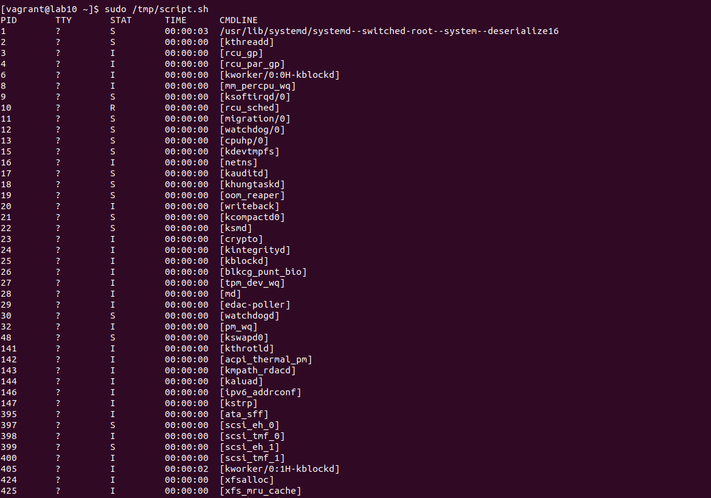
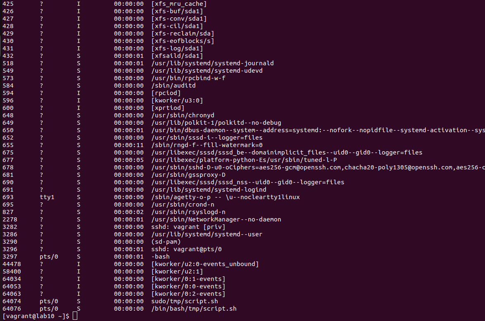

# Домашнее задание №10 "работаем с процессами"

## Работать с процессами 

## Задания:
1.Написать свою реализацию ps ax используя анализ /proc. Результат ДЗ - рабочий скрипт который можно запустить

## Решение:
1. При выполнении `vagrant up` разворачивается система, копируется файл скрипта [скрипт](./script.sh) в директорию /tmp/script.sh
1. [Скрипт](./script.sh) выполняет следующие действия:
    - анализирует директорию /proc и собирает статистическую информацию о запущенных процессах.
    - результат выводится на экран в формате соответствующем команде `ps ax`
1. Информация в выводе собирается из следующих источников:
    - PID - результат команды `ls -l /proc`
    - TTY - получаем из файловых дескрипторов `ls -l /proc/$pid/fd`. Наверно правильнее было бы брать его из /proc/stat, но не разобрался как конвертировать в "человеческий" вид :)
    - STAT - считываем из /proc/$pid/stat
    - TIME - расчитываем из параметров utime и stime в /proc/$pid/stat
    - CMD - считываем из /proc/$pid/cmdline либо /proc/$pid/status

## Результат:
1. Результат работы скрипта:

